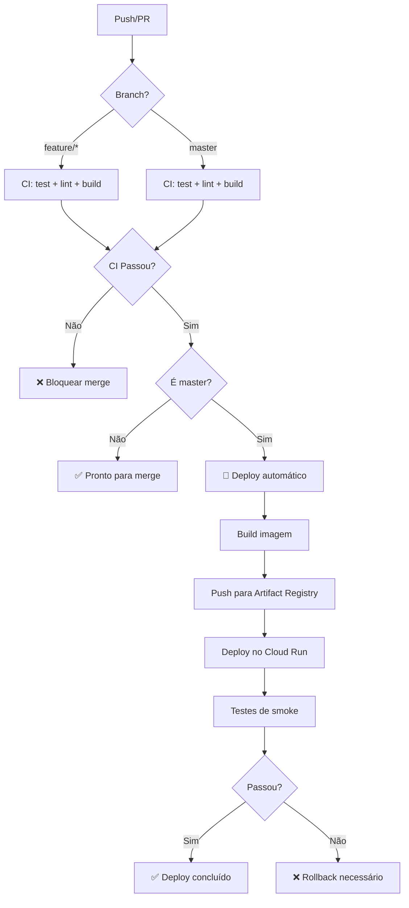

# GitHub Workflows e Configurações

Esta pasta contém workflows de CI/CD e configurações do GitHub para o projeto MLOps Educational Risk.

## 📂 Estrutura

```
.github/
├── workflows/
│   ├── ci.yml              # Continuous Integration (todos os pushes/PRs)
│   └── deploy.yml          # Deploy automático (master only)
├── pull_request_template.md  # Template de PR
└── README.md               # Este arquivo
```

## 🔄 Workflows

### CI (Integração Contínua)

**Arquivo:** `workflows/ci.yml`

**Trigger:**
- Push em qualquer branch (`master`, `develop`, `feature/**`)
- Pull requests para `master` ou `develop`

**Jobs:**

1. **test** - Testes e Cobertura
   - Build da imagem Docker
   - Treino do modelo (gera artifacts)
   - Execução dos testes
   - Verificação de cobertura ≥ 80%
   - Upload de coverage report (artifact)

2. **lint** - Qualidade de Código
   - Check de formatação (black)
   - Check de imports (isort)
   - Linting (flake8)

3. **security** - Segurança
   - Scan de vulnerabilidades em dependências (safety)

4. **docker-build** - Container
   - Build da imagem Docker
   - Health check do container

5. **summary** - Resumo
   - Agrega resultados de todos os jobs
   - Falha se qualquer job crítico falhar

**Tempo médio:** ~7 minutos

### Deploy (Entrega Contínua)

**Arquivo:** `workflows/deploy.yml`

**Trigger:**
- Push na branch `master`
- Execução manual (workflow_dispatch)

**Jobs:**

1. **deploy** - Build e Deploy
   - Checkout do código
   - Autenticação no GCP
   - Treino do modelo
   - Execução dos testes
   - Build e push da imagem Docker
   - Deploy no Cloud Run
   - Testes de smoke (health + predict)
   - Criação de deployment no GitHub

**Tempo médio:** ~8 minutos

**Secrets necessários:**
- `GCP_PROJECT_ID` - ID do projeto GCP
- `GCP_SA_KEY` - Chave JSON do service account

## 🔐 Secrets Configurados

Para ver/editar secrets:
`https://github.com/SEU_USUARIO/mlops-educational-risk/settings/secrets/actions`

| Secret | Descrição | Onde configurar |
|--------|-----------|-----------------|
| `GCP_PROJECT_ID` | ID do projeto Google Cloud | Execute `gcloud config get-value project` |
| `GCP_SA_KEY` | Chave JSON do service account | Execute `./scripts/setup_github_actions.sh` |

**Documentação completa:** [docs/github-actions-setup.md](../docs/github-actions-setup.md)

## 📊 Status Checks

Para merge na `master`, os seguintes checks **DEVEM** passar:

| Check | Descrição | Job | Workflow |
|-------|-----------|-----|----------|
| ✅ test | Testes com coverage ≥ 80% | test | ci.yml |
| ✅ lint | Code quality | lint | ci.yml |
| ✅ docker-build | Container funcional | docker-build | ci.yml |

## 🚀 Fluxo de Trabalho



## 🛠️ Customização

### Adicionar novo job ao CI

Edite `workflows/ci.yml`:

```yaml
jobs:
  # ... jobs existentes ...
  
  meu-novo-job:
    name: Meu Novo Job
    runs-on: ubuntu-latest
    steps:
      - uses: actions/checkout@v4
      - name: Fazer algo
        run: echo "Fazendo algo..."
```

### Adicionar step ao deploy

Edite `workflows/deploy.yml`:

```yaml
jobs:
  deploy:
    steps:
      # ... steps existentes ...
      
      - name: Meu step customizado
        run: |
          echo "Executando passo adicional"
```

### Mudar configuração do Cloud Run

Edite `workflows/deploy.yml` no step **Deploy to Cloud Run**:

```yaml
- name: Deploy to Cloud Run
  run: |
    gcloud run deploy ${{ env.SERVICE_NAME }} \
      --memory=1Gi \          # 512Mi → 1Gi
      --cpu=2 \               # 1 → 2
      --min-instances=1 \     # 0 → 1 (sempre ativo)
      --max-instances=20      # 10 → 20
```

## 📈 Monitorar Execuções

### Via GitHub UI

1. Acesse: `https://github.com/SEU_USUARIO/mlops-educational-risk/actions`
2. Veja histórico de workflows
3. Clique em uma execução para ver logs detalhados

### Via GitHub CLI

```bash
# Instalar gh CLI
brew install gh
gh auth login

# Listar execuções
gh run list

# Ver logs do último CI
gh run list --workflow=ci.yml --limit=1
gh run view --log

# Ver logs do último deploy
gh run list --workflow=deploy.yml --limit=1
gh run view --log

# Disparar deploy manual
gh workflow run deploy.yml
```

## 🔔 Notificações

GitHub envia notificações quando:
- ✅ Workflow completa com sucesso
- ❌ Workflow falha
- ⚠️ Workflow cancelado

**Configurar notificações:**
`https://github.com/settings/notifications`

## 🆘 Troubleshooting

### Workflow falha com "Authentication failed"

**Causa:** Secret `GCP_SA_KEY` inválido ou ausente

**Solução:**
1. Execute `./scripts/setup_github_actions.sh`
2. Copie a chave JSON completa
3. Atualize o secret no GitHub
4. Re-execute o workflow

### CI passa localmente mas falha no GitHub

**Causa:** Ambiente diferente ou cache de Docker

**Solução:**
```bash
# Limpar cache local
docker compose down -v
docker system prune -a

# Re-rodar
docker compose run --rm train
docker compose run --rm tests
```

### Deploy trava em "Waiting for condition"

**Causa:** Cloud Run está provisionando

**Solução:** Aguardar (pode levar até 5 minutos na primeira vez)

### Logs não aparecem no GitHub

**Causa:** Output muito grande ou caracteres especiais

**Solução:**
- Reduzir verbosidade do logging
- Usar `2>&1 | head -n 100` para limitar output

## 📚 Referências

- [GitHub Actions Quickstart](https://docs.github.com/en/actions/quickstart)
- [Workflow syntax](https://docs.github.com/en/actions/using-workflows/workflow-syntax-for-github-actions)
- [google-github-actions](https://github.com/google-github-actions)
- [Configuração completa](../docs/github-actions-setup.md)

---

**Última atualização:** 12 de março de 2026
